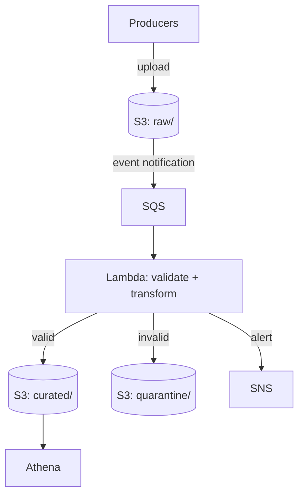

# AWS Event Ingestion Pipeline

Serverless event ingestion: raw events land in S3, get validated by Lambda consumers,
routed to curated storage or quarantined with alerts, and analyzed with Athena SQL.

## Architecture

## Status

- [x] Event generator + S3 raw landing
- [x] Lambda validation, quarantine routing, SNS alerting
- [x] Athena external table + pytest validation suite
- [ ] CDC with SCD Type 2 dimensions (in progress)
